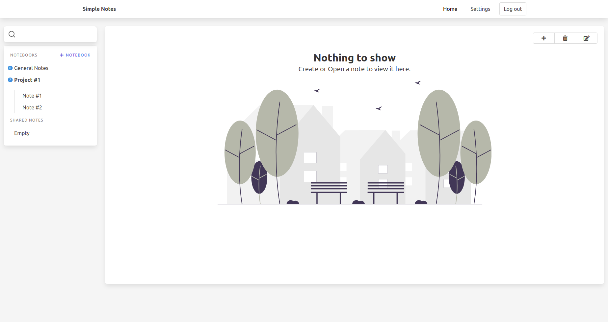

# Simple Notes Django App
A simple note-taking application written using python's django web framework.



## Features
 - Shortcuts
 - Organize notes into notebooks
 - Export notes as PDF files
 - Share your notes via a unique link
 - Multiple themes
 - Reminders

# Installation
Clone repo & create .env file from .env.example
```
git clone https://github.com/Namnetsy/simple-notes-django-app 
cd simple-notes-django-app
cp simple_notes/simple_notes/.env.example simple_notes/simple_notes/.env
```
Note: You may want to edit .env file to specify SECRET_KEY and some other information.

Install dependencies with Pipenv: `pipenv install` or with pip: `pip install -r requirements.txt`.

Run database migrations and the project itself:
```
./manage.py migrate
./manage.py runserver
```
